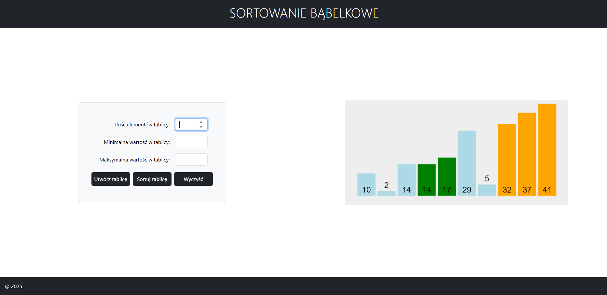

# 🔄 Bubble Sort Generator

Interaktywna aplikacja webowa umożliwiająca generowanie losowej tablicy liczb oraz jej sortowanie metodą bąbelkową (Bubble Sort).

---

## 📌 Opis projektu

Projekt został wykonany w celu utrwalenia wiedzy z zakresu:

- algorytmów sortowania
- generowania liczb losowych
- walidacji danych wejściowych
- manipulacji DOM w JavaScript
- pracy z modułami ES6 (import / export)

Użytkownik podaje ilość elementów tablicy oraz zakres liczb (min i max), a aplikacja generuje unikalną tablicę liczb i umożliwia jej posortowanie.

---

## ⚙️ Funkcjonalności

- ✅ Generowanie losowej tablicy liczb
- ✅ Liczby nie powtarzają się
- ✅ Sortowanie metodą bąbelkową
- ✅ Walidacja zakresu (zapobieganie błędom)
- ✅ Czytelny interfejs z wykorzystaniem Bootstrap
- ✅ Działanie w oparciu o moduły JavaScript (type="module")

---

## 🛠️ Technologie

- HTML5  
- CSS3 (Bootstrap 5)  
- JavaScript (ES6 Modules)  

---

## ▶️ Jak uruchomić projekt

1. Sklonuj repozytorium:

```
git clone https://github.com/BartBak1507/bubble-sort-generator.git
```

2. Otwórz projekt w VS Code.
3. Uruchom przy pomocy **Live Server**.
4. Otwórz `index.html` w przeglądarce.

⚠️ Projekt wymaga uruchomienia przez serwer lokalny (ze względu na użycie modułów JavaScript).

---

## 📷 Podgląd aplikacji



---

## 🧠 Jak działa aplikacja?

1. Użytkownik podaje:
   - ilość elementów
   - wartość minimalną
   - wartość maksymalną
2. Program sprawdza czy zakres pozwala na wygenerowanie unikalnych liczb
3. Tworzona jest tablica losowych liczb
4. Po kliknięciu „Sortuj tablicę” wykonywany jest algorytm Bubble Sort
5. Wynik wyświetlany jest w prawej części aplikacji

---

## 📂 Struktura projektu

```
bubble-sort-generator/
│
├── index.html
├── app.js
├── utils.js
├── obrazek.gif
└── README.md
```

---

## 👨‍💻 Autor

Bartosz Bąk  
GitHub: https://github.com/BartBak1507
